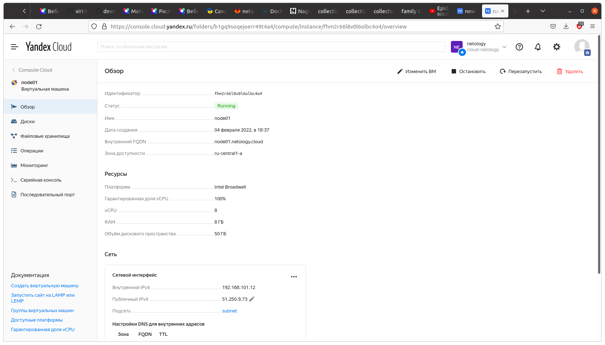
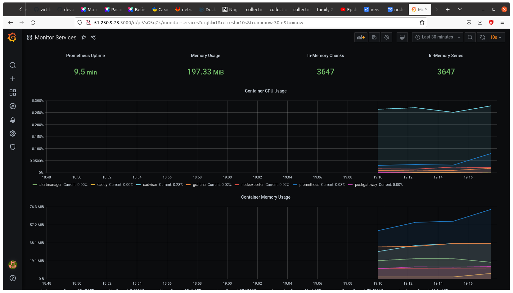

# Домашнее задание к занятию "5.4. Оркестрация группой Docker контейнеров на примере Docker Compose"

## Как сдавать задания

Обязательными к выполнению являются задачи без указания звездочки. Их выполнение необходимо для получения зачета и диплома о профессиональной переподготовке.

Задачи со звездочкой (*) являются дополнительными задачами и/или задачами повышенной сложности. Они не являются обязательными к выполнению, но помогут вам глубже понять тему.

Домашнее задание выполните в файле readme.md в github репозитории. В личном кабинете отправьте на проверку ссылку на .md-файл в вашем репозитории.

Любые вопросы по решению задач задавайте в чате учебной группы.

---

## Задача 1

Создать собственный образ операционной системы с помощью Packer.

Для получения зачета, вам необходимо предоставить:
- Скриншот страницы, как на слайде из презентации (слайд 37).

```bash
vagrant@server1:~/packer$ packer  build  centos-7-base.json 
....................
    yandex: Complete!
==> yandex: Stopping instance...
==> yandex: Deleting instance...
    yandex: Instance has been deleted!
==> yandex: Creating image: centos-7-base
==> yandex: Waiting for image to complete...
==> yandex: Success image create...
==> yandex: Destroying boot disk...
    yandex: Disk has been deleted!
Build 'yandex' finished after 3 minutes 14 seconds.

==> Wait completed after 3 minutes 14 seconds

==> Builds finished. The artifacts of successful builds are:
--> yandex: A disk image was created: centos-7-base (id: fd82h9g9tqlq7dd4gumk) with family name centos
vagrant@server1:~/packer$ yc compute image list
+----------------------+---------------+--------+----------------------+--------+
|          ID          |     NAME      | FAMILY |     PRODUCT IDS      | STATUS |
+----------------------+---------------+--------+----------------------+--------+
| fd82h9g9tqlq7dd4gumk | centos-7-base | centos | f2eacrudv331nbat9ehb | READY  |
+----------------------+---------------+--------+----------------------+--------+
```  


## Задача 2

Создать вашу первую виртуальную машину в Яндекс.Облаке.

Для получения зачета, вам необходимо предоставить:
- Скриншот страницы свойств созданной ВМ, как на примере ниже:  
  
Решение:
<p align="center">
  
</p>

## Задача 3

Создать ваш первый готовый к боевой эксплуатации компонент мониторинга, состоящий из стека микросервисов.

Для получения зачета, вам необходимо предоставить:
- Скриншот работающего веб-интерфейса Grafana с текущими метриками, как на примере ниже  

Решение:
<p align="center">
  
</p>

## Задача 4 (*)

Создать вторую ВМ и подключить её к мониторингу развёрнутому на первом сервере.

Для получения зачета, вам необходимо предоставить:
- Скриншот из Grafana, на котором будут отображаться метрики добавленного вами сервера.

